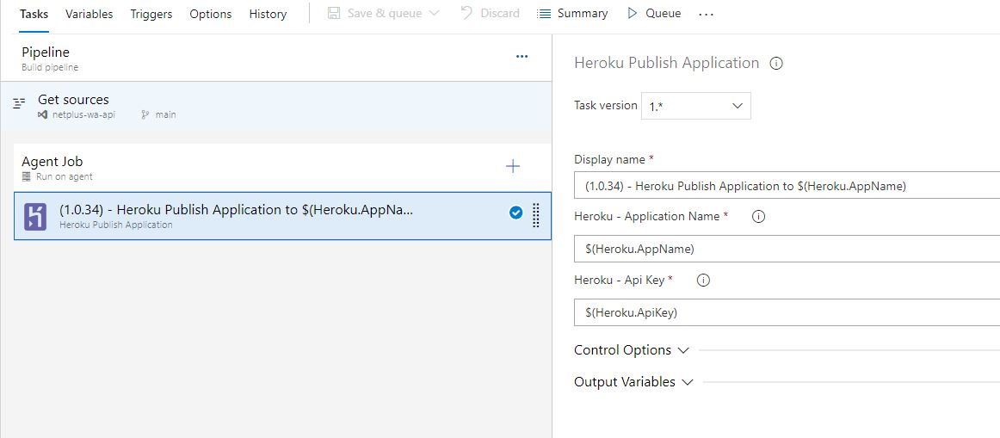

# Heroku Application Publish



[](https://marketplace.visualstudio.com/items?itemName=renerlemes.netplus-vsextension-heroku)
[](https://marketplace.visualstudio.com/items?itemName=renerlemes.netplus-vsextension-heroku)
[](https://marketplace.visualstudio.com/items?itemName=renerlemes.netplus-vsextension-heroku)
[](https://marketplace.visualstudio.com/items/RenerLemes.netplus-vsextension-heroku/license)

## Overview

The purpose of the Heroku Application Publish task is to facilitate the publish an application to Heroku.

## Task Configuration

The process of configuration consists of two basic steps:

1. Clone a source repository
2. Push that repository to Heroku Git

Both of these steps may require additional access in order to read or write to the relevant repositories. In order to provide that access, Personal Access Tokens (PATs) are used to grant the build agent the access it needs to perform these actions.

**Heroku - Application Name**

The application name

**Heroku - Api Key**

A Personal Access Token that grants read access to the Git repository. Is possible to obtain in a Account Settings in Heroku - https://dashboard.heroku.com/account 

### YAML Pipeline
When using the Heroku Application Publish task in a YAML-based pipeline, the task configuration uses the following input names:

* `herokuApplicationName`
* `herokuApiKey` 
  
* There are still two fields that are not visible, which are the ones that get the current repository and the read access token from that repository.

```yml
- task: RenerLemes.netplus-vsextension-heroku.netplus-vsextension-heroku.netplus-vsextension-heroku@1
  displayName: 'Heroku Publish Application'
  inputs:
    herokuApplicationName: 'heroku-app-name'
    herokuApiKey: '123456-789012-345678-901234'
```

<br/>

## Best Practices

### Generating Heroku ApiKey

In order to use this task, you will need to get the ApiKey. Below have a link on how to achieve this:

- [How to get an apikey in Heroku](https://help.heroku.com/PBGP6IDE/how-should-i-generate-an-api-key-that-allows-me-to-use-the-heroku-platform-api)

### Securing Variables during the build

While you have the ability to enter the application name and api key into the task in plain-text, it is best practice to mask these values so that your repositories remain secure. Azure Pipelines supports the ability to manage and inject secure variables at build time. There are currently two ways to achieve this in Azure Pipelines:

- [Use a Secret Process Variable directly on the build definition](https://learn.microsoft.com/en-us/azure/devops/pipelines/process/set-secret-variables?view=azure-devops&tabs=yaml%2Cbash)

By using secret variables in your build task, your values will be masked in any build output.

## Credits

This extension was created based on [vsts-mirror-git-repository](https://github.com/swellaby/vsts-mirror-git-repository), and much of the text and code was based on it.